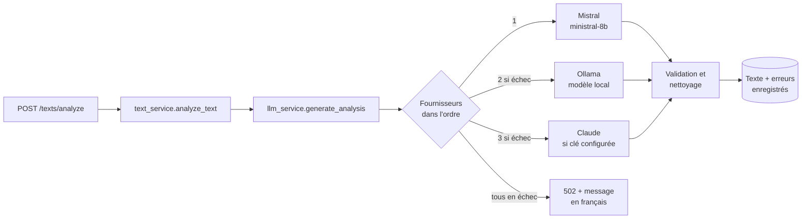

# LinguaTrack API

API de **LinguaTrack**, une application de correction de textes en français assistée par IA.
L'utilisateur envoie un texte et un mode de correction ; l'API renvoie le texte corrigé, un score sur 100
et la liste des erreurs (type, sévérité, explication). Un tableau de bord et un historique
permettent de suivre sa progression.

- **Stack :** FastAPI, SQLAlchemy 2, Pydantic v2, JWT, PostgreSQL (ou SQLite en local)
- **IA :** Mistral (`ministral-8b-latest`), avec repli sur un modèle local via Ollama, puis sur Claude
- **Front :** dépôt séparé [`linguaTrack_web`](https://github.com/AdouaniHoussemKhalil/linguaTrack_web) (React + Vite)

## Sommaire

1. [Démarrage rapide](#démarrage-rapide)
2. [Configuration](#configuration)
3. [Docker](#docker)
4. [Architecture](#architecture)
5. [API](#api)
6. [L'IA dans LinguaTrack](#lia-dans-linguatrack)
7. [Dépannage](#dépannage)
8. [Limites connues et prochaines étapes](#limites-connues-et-prochaines-étapes)
9. [Contribuer](#contribuer)

---

## Démarrage rapide

Prérequis : Python 3.11 ou plus récent (l'image Docker utilise 3.11 ; développé et testé en 3.13).

```bash
cd linguaTrack_back_end

# 1. Environnement virtuel (évite de modifier le Python global)
python -m venv .venv
.venv\Scripts\activate            # Windows
# source .venv/bin/activate       # macOS / Linux

# 2. Dépendances
pip install -r requirements.txt

# 3. Configuration : copier le modèle puis renseigner au moins SECRET_KEY et MISTRAL_API_KEY
copy .env.example app\.env        # Windows
# cp .env.example app/.env        # macOS / Linux

# 4. Lancer le serveur
uvicorn app.main:app --reload --port 8000
```

- API : http://localhost:8000
- Documentation interactive (Swagger) : http://localhost:8000/docs
- Santé : http://localhost:8000/health/

> Si Windows ne trouve pas `uvicorn`, lancez `python -m uvicorn app.main:app --reload --port 8000`.

Le schéma de la base est créé et mis à jour automatiquement au démarrage (migrations Alembic, voir
[Migrations](#migrations-de-la-base)). Sans `DATABASE_URL`, la base est un fichier SQLite `linguatrack.db`
à la racine du dossier (ignoré par Git).

Pour générer une `SECRET_KEY` :

```bash
python -c "import secrets; print(secrets.token_hex(32))"
```

---

## Configuration

Toute la configuration est lue par [`app/core/config.py`](app/core/config.py) (`pydantic-settings`),
depuis les variables d'environnement puis le fichier **`app/.env`**. Ce fichier contient des secrets :
il n'est **jamais commité**. Le modèle à copier est [`.env.example`](.env.example).
La configuration est validée au démarrage : l'API refuse de démarrer sans `SECRET_KEY`.

| Variable | Défaut | Rôle |
|---|---|---|
| `SECRET_KEY` | **obligatoire** | Signature des tokens JWT |
| `ALGORITHM` | `HS256` | Algorithme JWT |
| `ACCESS_TOKEN_EXPIRE_MINUTES` | `60` | Durée de validité d'une connexion |
| `DATABASE_URL` | `sqlite:///./linguatrack.db` | Base de données (PostgreSQL en production) |
| `SQL_ECHO` | `false` | Affiche les requêtes SQL (débogage) |
| `CORS_ORIGINS` | `http://localhost:5173` | Origines autorisées, séparées par des virgules |
| `LLM_PROVIDERS` | `mistral,ollama,claude` | Ordre des fournisseurs d'IA (voir [plus bas](#la-chaîne-de-fournisseurs)) |
| `MISTRAL_API_KEY` | — | Clé Mistral ; sans clé, Mistral est ignoré |
| `MISTRAL_MODEL` | `ministral-8b-latest` | Modèle Mistral |
| `OLLAMA_URL` | `http://localhost:11434` | Serveur Ollama |
| `OLLAMA_MODEL` | `deepseek-r1:1.5b` | Modèle local ; vide = Ollama désactivé |
| `OLLAMA_TIMEOUT` | `180` | Délai maximum d'une analyse locale (secondes) |
| `ANTHROPIC_API_KEY` | — | Clé Claude (payante) ; sans clé, Claude est ignoré |
| `ANTHROPIC_MODEL` | `claude-opus-5` | Modèle Claude |

---

## Docker

```bash
docker-compose up --build
```

Démarre deux conteneurs :

- **`api`** : l'API sur le port 8000. Elle lit `app/.env`, mais `docker-compose` impose la `DATABASE_URL`
  du conteneur PostgreSQL et `OLLAMA_URL=http://host.docker.internal:11434` (Ollama tourne sur la machine
  hôte, pas dans le conteneur).
- **`db`** : PostgreSQL 15 sur le port 5432. Ses données sont conservées dans le volume `pgdata`
  (`docker-compose down -v` pour repartir d'une base vide). L'API attend que la base soit prête.

Après une modification de `requirements.txt` : `docker-compose up --build`.
Le fichier [`.dockerignore`](.dockerignore) exclut `app/.env` et la base SQLite : les secrets ne sont
jamais copiés dans l'image.

---

## Architecture

```
alembic/               # migrations de la base (versions/)
app/
├── main.py            # création de l'app, CORS, migrations au démarrage, routers
├── core/
│   ├── config.py      # Settings (pydantic-settings), validés au démarrage
│   ├── database.py    # engine SQLAlchemy, get_db()
│   ├── security.py    # hachage bcrypt, création des JWT
│   ├── dependencies.py# get_current_user() : utilisateur du token
│   └── migrations.py  # applique les migrations Alembic au démarrage
├── models/            # tables SQLAlchemy + enums (modes, niveaux, sévérités)
├── schemas/           # modèles Pydantic des requêtes et réponses
├── routers/           # health, users, texts : minces, ils délèguent aux services
└── services/
    ├── user_service.py    # inscription, authentification
    ├── text_service.py    # analyse d'un texte, historique, statistiques du dashboard
    ├── llm_service.py     # chaîne de fournisseurs d'IA + appel Mistral
    ├── ollama_service.py  # appel au modèle local (Ollama)
    ├── claude_service.py  # appel à Claude (Anthropic)
    └── llm_common.py      # prompt, schéma JSON, validation, erreurs communes
```

**Règle :** les routers ne contiennent pas de logique métier ; elle vit dans `services/`.

### Modèle de données

| Table | Contenu |
|---|---|
| `users` | email (unique), mot de passe haché (bcrypt), prénom, nom, niveau (A1 à C2) |
| `texts` | texte original et corrigé, mode, niveau cible, score, temps de traitement, date |
| `errors` | erreurs d'un texte : type, sévérité, fragment original, correction, explication |
| `user_error_stats` | prévue pour des statistiques par type d'erreur, **pas encore alimentée** |

### Migrations de la base

Le schéma est géré par [Alembic](https://alembic.sqlalchemy.org) (dossier `alembic/versions/`).
**Au démarrage, l'API applique toutes les migrations en attente** : rien à lancer à la main.
Une base créée avant l'arrivée d'Alembic (tables présentes, sans table `alembic_version`) est d'abord
marquée comme étant à la migration initiale : ses tables et ses données sont conservées.

Après une modification d'un modèle (`app/models/`), créer la migration correspondante :

```bash
alembic revision --autogenerate -m "ajouter la colonne feedback"
# relire le fichier généré dans alembic/versions/, puis :
alembic upgrade head          # ou simplement redémarrer l'API
```

Autres commandes utiles : `alembic current` (révision de la base), `alembic history`,
`alembic downgrade -1` (annuler la dernière migration), `alembic check` (modèles et base alignés ?).
Alembic utilise la même `DATABASE_URL` que l'API. Sous SQLite, les modifications de colonnes passent
par le mode *batch* (recréation de la table), géré automatiquement.

---

## API

Documentation complète et testable : **http://localhost:8000/docs**.

| Méthode | Route | Auth | Rôle |
|---|---|---|---|
| `POST` | `/users/register` | — | Inscription (`email`, `password`, `firstName`, `lastName`, `level`) |
| `POST` | `/users/login` | — | Connexion (`username` = email, `password`) |
| `POST` | `/users/token` | — | Connexion au format OAuth2 (bouton *Authorize* de Swagger) |
| `GET` | `/users/me` | ✅ | Profil de l'utilisateur connecté |
| `PATCH` | `/users/me` | ✅ | Modifier prénom, nom, niveau (`firstName`, `lastName`, `level`, tous facultatifs) |
| `PUT` | `/users/me/password` | ✅ | Changer de mot de passe (`current_password`, `new_password`) ; 204 |
| `POST` | `/texts/analyze` | ✅ | Analyse d'un texte (`text` ≤ 5 000 caractères, `mode`, `target_level` facultatif) |
| `GET` | `/texts/modes` | — | Modes disponibles |
| `GET` | `/texts/history?period=` | ✅ | Textes analysés sur la période |
| `GET` | `/texts/history/{user_id}/{text_id}` | ✅ | Détail d'un texte (uniquement les siens) |
| `GET` | `/texts/dashboard?period=` | ✅ | Statistiques et tendances |
| `GET` | `/texts/progress?period=` | ✅ | Évolution du score : textes, score moyen et erreurs par heure, jour, semaine ou mois |
| `GET` | `/health/` | — | État de l'API |

- **Authentification :** `Authorization: Bearer <access_token>`, token obtenu à la connexion ou à l'inscription.
- **Périodes :** `all`, `day`, `week`, `month`, `year`. Hors `all`, le dashboard compare avec la période
  précédente (`*_change`, en %).
- **Modes :** `correction`, `professional`, `simple`, `natural`, `persuasive`.
- **Convention :** `/users/register` et `/users/login` répondent toujours HTTP 200 au format
  `{is_success, error, access_token, user_id}` ; le front s'appuie sur ce format.
- **Mot de passe :** au moins 8 caractères, une minuscule, une majuscule et un chiffre (même règle que le front).
- **Erreurs :** 401 (token absent ou expiré), 403 (texte d'un autre utilisateur), 404, 422 (requête invalide),
  **502 si l'IA n'a pas pu analyser le texte** (message en français dans `detail`).

---

## L'IA dans LinguaTrack

### Parcours d'une analyse



1. **Le prompt** ([`llm_common.build_prompts`](app/services/llm_common.py)) est identique pour tous les
   fournisseurs. Il contient le texte, le mode, le niveau cible (celui de la requête, sinon celui de
   l'utilisateur) et impose : réponse en français, 12 types d'erreurs en français (grammaire, orthographe,
   conjugaison, vocabulaire, syntaxe, ponctuation, accord, article, préposition, temps, style, registre)
   et 3 sévérités (`low`, `medium`, `high`).
2. **La forme de la réponse est imposée par un schéma JSON** (`ANALYSIS_SCHEMA`) : texte corrigé, score,
   feedback, liste d'erreurs. Chaque fournisseur utilise la sortie structurée qu'il propose ;
   le modèle ne peut pas renvoyer de champ inventé ni de type d'erreur hors liste.
3. **La réponse est validée et nettoyée** avant d'être enregistrée :
   - score borné entre 0 et 100, type d'erreur inconnu remplacé par « grammaire », sévérité invalide ignorée ;
   - **erreurs incohérentes écartées** : fragment absent du texte soumis, correction vide, identique
     à l'original ou non informative (« correct ») ;
   - **score 100 ignoré s'il contredit des erreurs listées** (le front affiche alors « – ») ;
   - comparaisons insensibles à la typographie : remplacer `'` par `’` n'est pas une faute.
4. **Enregistrement** : le texte et ses erreurs sont enregistrés en une seule transaction.
   Si aucun fournisseur n'aboutit, rien n'est enregistré et l'API répond 502.

### La chaîne de fournisseurs

`LLM_PROVIDERS` fixe l'ordre (défaut `mistral,ollama,claude`). Un fournisseur non configuré est ignoré ;
un échec (quota, panne, délai dépassé, réponse invalide ou tronquée) passe au suivant.
Les logs indiquent qui a produit chaque analyse (`Analyse réalisée par …`).

| Fournisseur | Rôle | Coût | Temps mesuré | Activation |
|---|---|---|---|---|
| **Mistral** `ministral-8b-latest` | Principal | Inclus dans l'offre actuelle (188 requêtes/min) | 3 à 10 s | `MISTRAL_API_KEY` |
| **Ollama** `deepseek-r1:1.5b` | Secours local, hors ligne | Gratuit | 50 à 130 s sur CPU | Ollama lancé + `OLLAMA_MODEL` |
| **Claude** `claude-opus-5` | Dernier secours | Payant (quelques centimes par analyse) | — | `ANTHROPIC_API_KEY` |

### Mistral : ce qui a été fait

Au départ, l'application appelait `mistral-medium-latest` et échouait systématiquement en **429 « Rate
limit exceeded »**, même après une nouvelle clé. Le diagnostic, fait en lisant les en-têtes de limite
renvoyés par Mistral, a montré qu'il ne s'agissait **pas d'un quota épuisé** :

| Modèle | Réponse | `x-ratelimit-limit-req-minute` |
|---|---|---|
| `mistral-large-latest` | 403 « not available in your subscription » | — |
| `mistral-medium-latest`, `mistral-small-latest`, `magistral-*` | 429 | **0** |
| `ministral-8b-latest` (et ses alias `open-mistral-nemo`, `open-mistral-7b`) | 200 | 188 |
| `ministral-3b-latest` | 200 | 750 |

**L'abonnement n'ouvre que les modèles Ministral** : une limite à 0 signifie que le modèle est fermé,
pas qu'il faut attendre. Les limites sont attachées à l'espace de travail Mistral, pas à la clé : changer
de clé ne pouvait donc rien changer. Corrections apportées :

- **Modèle configurable** (`MISTRAL_MODEL`), par défaut `ministral-8b-latest`.
- **Sortie structurée `json_schema` stricte** au lieu du simple mode `json_object`, qui garantissait un JSON
  valide mais pas sa forme : `ministral-8b` renvoyait parfois un `feedback` en objet ou une liste d'erreurs
  vide. Avec le schéma, 6 analyses sur 6 identiques et correctes lors des tests.
- **Erreurs Mistral** (clé refusée, quota, réseau, réponse tronquée) converties en message français,
  puis passage au fournisseur suivant.
- `mistralai` épinglé en **1.12.4** : la 2.x ne s'installe pas sous Windows (chemins de fichiers trop longs).

Pour revenir à un modèle plus puissant avec une offre supérieure : `MISTRAL_MODEL=mistral-medium-latest`
dans `app/.env`. Pour voir les modèles et limites de votre compte : page *Limits* de
[console.mistral.ai](https://console.mistral.ai).

### Ollama (modèle local)

[Ollama](https://ollama.com) fait tourner un modèle sur votre machine, gratuitement et hors ligne.

```bash
ollama pull deepseek-r1:1.5b     # une seule fois
ollama serve                     # si Ollama ne tourne pas déjà
```

`deepseek-r1:1.5b` est un **modèle de raisonnement** : il « réfléchit » (bloc `<think>`) avant de répondre.
[`ollama_service.py`](app/services/ollama_service.py) gère ses particularités :
réflexion ignorée, sortie contrainte par le schéma JSON (`format`), balises `<think>` et blocs ```` ```json ````
retirés par sécurité, contexte porté à 8 192 tokens, délai dédié (`OLLAMA_TIMEOUT`).

> ⚠️ Ce modèle de 1,5 milliard de paramètres **corrige beaucoup moins bien** que Ministral : il oublie des
> fautes, en ajoute parfois et explique en anglais. C'est un secours pour ne pas bloquer l'utilisateur.
> Un autre modèle se choisit sans toucher au code : `ollama pull qwen2.5:7b` puis `OLLAMA_MODEL=qwen2.5:7b`.

### Claude (facultatif, payant)

Actif seulement si `ANTHROPIC_API_KEY` est renseignée (clé API sur
[console.anthropic.com](https://console.anthropic.com), facturée à l'usage, distincte d'un abonnement
Claude Pro). Sortie structurée par schéma JSON, et repli côté serveur si le modèle refuse la requête
(`fallbacks: "default"`). Sans la clé ou sans le paquet `anthropic`, Claude est simplement ignoré.

### Modifier le comportement de l'IA

- **Prompt, types d'erreurs, sévérités :** [`llm_common.py`](app/services/llm_common.py)
  (`ERROR_TYPES`, `SEVERITIES`, `build_prompts`, `ANALYSIS_SCHEMA`). Les types d'erreurs doivent rester
  en français : le front les affiche tels quels.
- **Changer de modèle :** `MISTRAL_MODEL`, `OLLAMA_MODEL`, `ANTHROPIC_MODEL` dans `app/.env`.
- **Changer l'ordre ou désactiver un fournisseur :** `LLM_PROVIDERS` (par exemple `mistral,ollama`).
- **Ajouter un fournisseur :** un module `xxx_service.py` exposant `is_configured()` et
  `analyze(system_prompt, user_prompt, source_text) -> dict`, déclaré dans `_providers()` de
  [`llm_service.py`](app/services/llm_service.py).

---

## Dépannage

| Symptôme | Cause probable | Solution |
|---|---|---|
| L'API refuse de démarrer : `SECRET_KEY … Field required` | `SECRET_KEY` absente de `app/.env` | L'ajouter (voir [Démarrage rapide](#démarrage-rapide)) |
| `ModuleNotFoundError` au démarrage | Dépendances non installées | `pip install -r requirements.txt` dans le `.venv` |
| Logs `Fournisseur mistral en échec … 429` | Modèle fermé à votre offre ou quota atteint | Vérifier `MISTRAL_MODEL` ; tester avec le tableau [ci-dessus](#mistral--ce-qui-a-été-fait) |
| Analyse très lente (≥ 1 min) | Mistral a échoué, l'analyse passe par Ollama | Normal sur CPU ; le front attend jusqu'à 4 minutes |
| 502 « Le service d'analyse est momentanément indisponible » | Tous les fournisseurs ont échoué | Lire les logs (`Fournisseur … en échec`) |
| Le front affiche une erreur réseau / CORS | Origine du front non autorisée | Ajouter son URL à `CORS_ORIGINS` |
| `uvicorn` n'est pas reconnu (Windows) | Script non présent dans le `PATH` | `python -m uvicorn app.main:app --reload --port 8000` |

---

## Limites connues et prochaines étapes

- **Le `feedback` global du modèle n'est pas enregistré** ; `user_error_stats` n'est pas alimentée.
- **Le mode est transmis au modèle par son seul nom** (`professional`, `simple`…), sans consigne détaillée.
- **Pas encore de tests** dans le dépôt.
- `datetime.utcnow` est déprécié.
- Les « exercices personnalisés » évoqués au début du projet ne sont pas implémentés.

---

## Contribuer

- Branches `feature/…` ou `fix/…` créées depuis `develop`, commits au format
  [Conventional Commits](https://www.conventionalcommits.org/fr/), Pull Request vers `develop`.
- `develop` est fusionnée dans `main` par une PR de release.
- Code en anglais ; messages d'erreur, prompts et textes destinés à l'utilisateur en français.
- Ne jamais commiter `app/.env` ni `linguatrack.db`.
